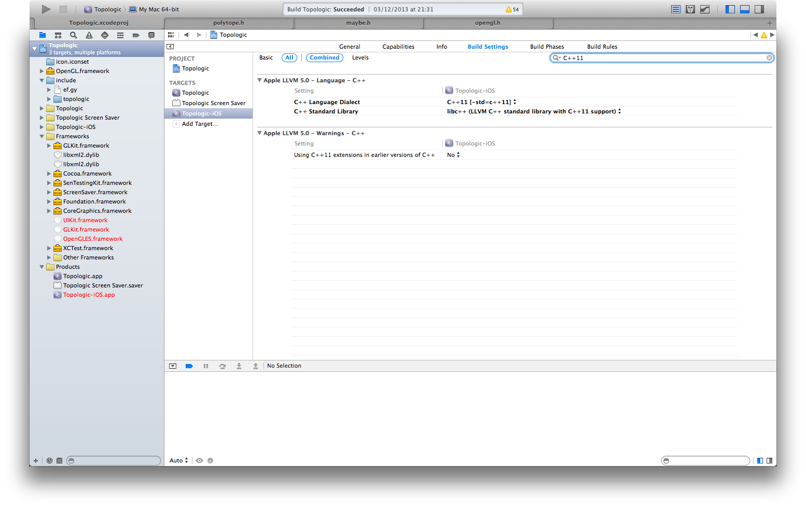
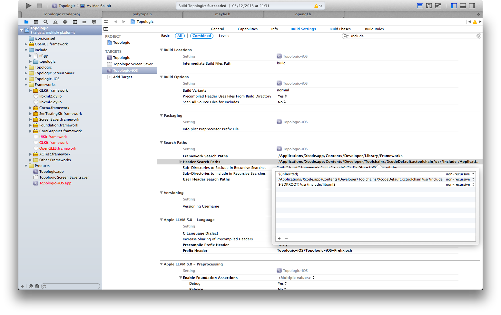

# Compiling Topologic on OSX with Xcode 5 #####################################

As the App Store apps should probably suggest, I do find myself using Xcode a
lot when I'm on OSX. The commentary thread for Topologic/7 contains quite a bit
of information on how to get started with Xcode, so I thought it'd be a good
idea to provide a short tutorial on getting started.

## STEP 1: Checking out the source code #######################################

Bring up a Terminal window (Apple+Space and type "Termial", should be the first
hit), then browse to the directory where you keep all your projects. If you
don't have one, create one and cd into it like this:

    ~$ make projects
    ~$ cd projects
    ~/projects$

Next, use the "git" programme to check out libefgy and topologic:

    ~/projects$ git clone git://git.becquerel.org/jyujin/libefgy.git
    ~/projects$ git clone git://git.becquerel.org/jyujin/topologic.git

Feel free to substitute the repositories with their github mirrors. libefgy's
github address is https://github.com/jyujin/libefgy.git and topologic's github
address is https://github.com/jyujin/topologic.git

## STEP 2: Create project in Xcode ############################################

Simply create a new project like you always would in Xcode - to compile the
GLUT client in particular, use the "command line application" template when
asked by the New Project Wizard.

Save this new project in your "projects" directory. For the purposes of this
tutorial, I'll assume that you saved it at ~/projects/topologic-xcode

## STEP 3: Create library symlinks ############################################

Back in your terminal window, change into your xcode project directory, create
an "include" directory and symlink the include directories in the source code
repositories:

    ~/projects$ cd topologic-xcode
    ~/projects/topologic-xcode$ mkdir include
    ~/projects/topologic-xcode$ ln -s ../libefgy/include/ef.gy include/
    ~/projects/topologic-xcode$ ln -s ../topologic/include/topologic include/

NOTE: technically you could just copy these directories with Finder, but by
      creating symbolic links you'll be able to update to the most recent
      version of the libraries by just running "git pull" in the repositories'
      directories.

You should also exclude these symlinks from being committed to your local git
repository - which Xcode helpfully created for your new project - by adding the
two paths to your .gitignore file:

    ~/projects/topologic-xcode$ echo include/ef.gy >> .gitignore
    ~/projects/topologic-xcode$ echo include/topologic >> .gitignore

## STEP 4: Configure your Xcode target ########################################

There's a few things you'll have to tell Xcode before it'll be able to compile
any of Topologic's code. You'll find these settings in the target
"Build Settings" tab.

First of all, you'll have to add the "include" directory you created to the
list of "User Header Search Paths". Make sure to add this directory
non-recursively - adding it recursively will result in a lot of very weird
errors. This screenshot should illustrate what the section ought to look like:

Next, make sure that the C++ files are actually compiled in C++11 mode, and
that Xcode uses clang's/LLVM's own standard C++ library (i.e. libc++ instead of
libstdc++); this is probably the default by now, but the relevant settings
should look like this:

If you intend to use Topologic's built-in XML parser wrapper, which is able to
read the metadata saved to SVGs by Topologic's SVG renderer, you will also need
to add the libxml2 headers to the list of system include paths. To do so, add
the path "$(SDKROOT)/usr/include/libxml2" to the "Header Search Paths", like
this:

You could also disable the use of libxml2 with a \#define - it's up to you,
really.

Finally, you need to enable optimisations - even for your Debug target. Somehow
the code won't work properly when optimisations are completely disabled - I'm
not entirely sure why that is, but that's the way it is. Make sure that under
"Code Generation" the "Optimization Level" settings are set to "Fast" or
higher. If it's set to "none", then the code WILL crash. Here's another
screenshot so you know where to find this setting:

## STEP 5: Add necessary frameworks ###########################################

Add any necessary frameworks you're going to need; which of these you'll need
to add depends on what you're up to, of course. If you're trying to compile the
GLUT client, add the "GLUT" and "OpenGL" frameworks, and the "libxml2.2.dylib".

## STEP 6: Begin coding #######################################################

That should be all you need to do to get the code to compile. If you wanted to
compile the GLUT client, replace the contents of the "main.cpp" file that Xcode
created with the contents of the src/topologic-glut.cpp file in this
repository - that's also as good a starting point for your own projects as any.

Now get cracking, and have fun! Oh, and do drop me a line if you come up with
anything cool - as usual, send mails to <magnus@ef.gy> or join the \#kyuba
channel on freenode.
